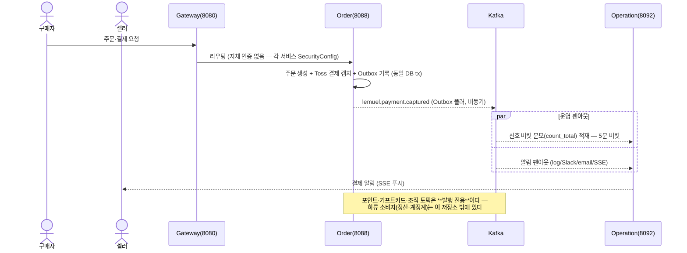
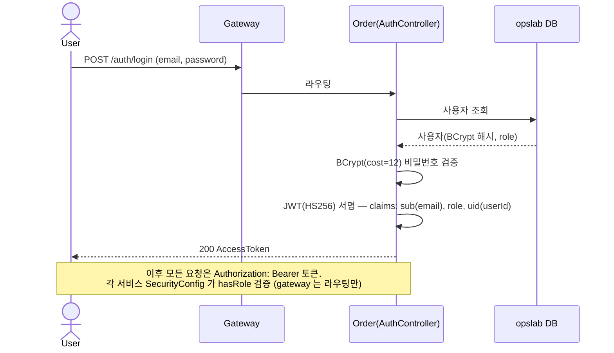
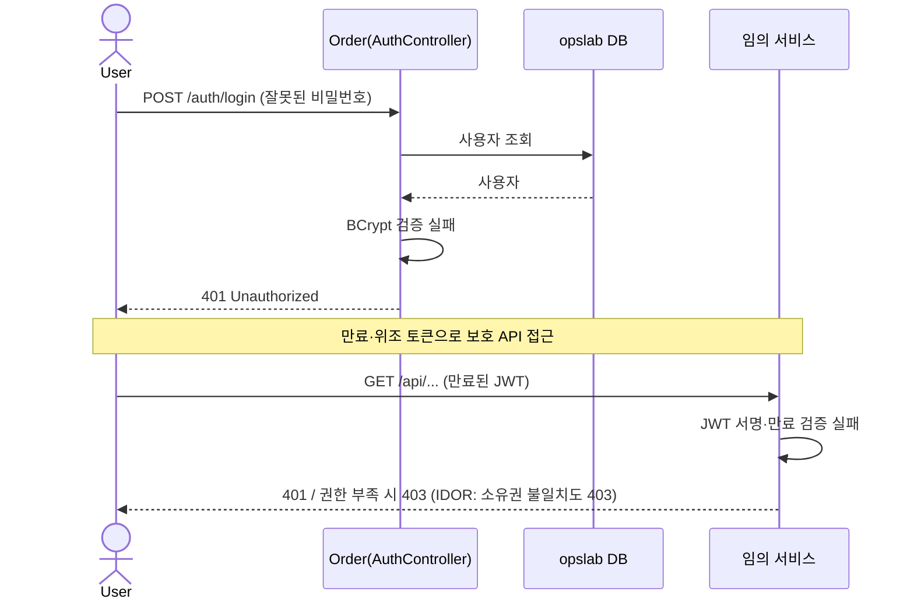
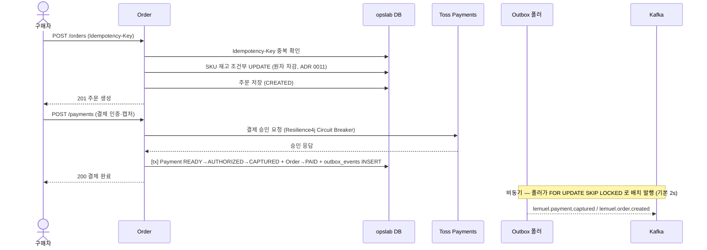
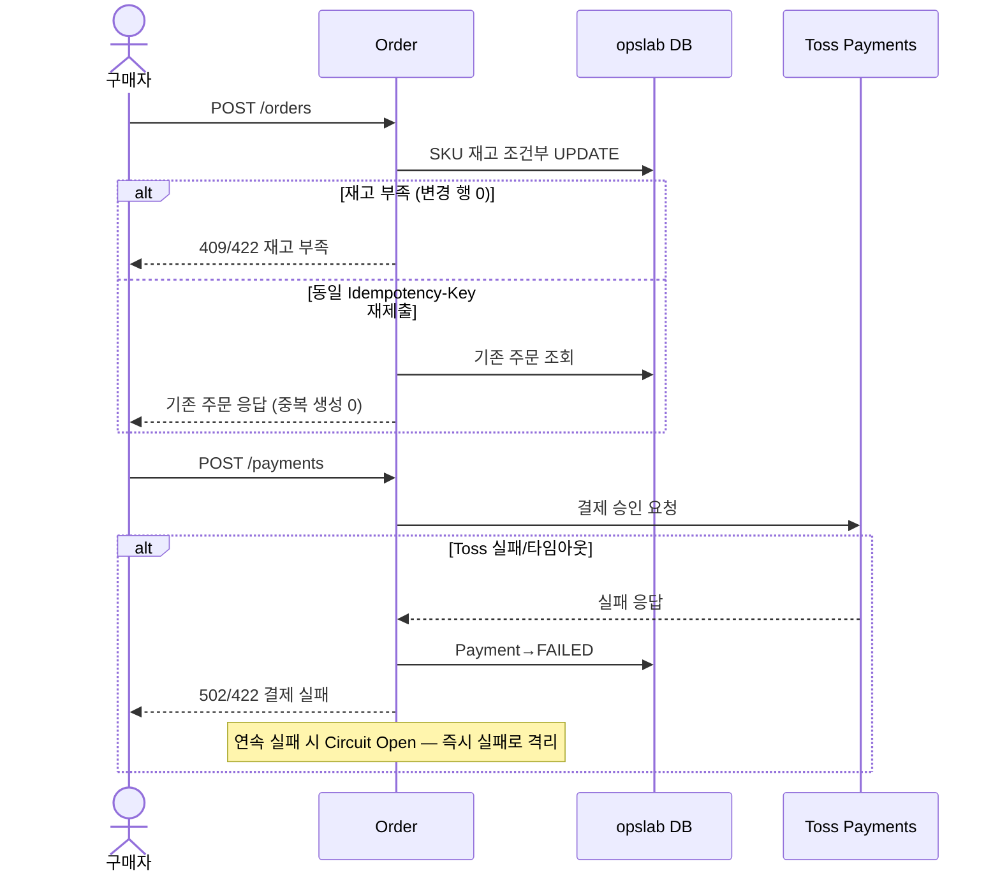

# Shop 시퀀스 다이어그램 (Sequence Diagrams)

> 쇼핑몰 MSA(2 서비스 + gateway)의 **핵심 유스케이스별 시퀀스 다이어그램**.
> 서비스 간 연계는 Kafka 이벤트로만 이루어지며(코드·DB 직접 의존 0), 비동기 구간은 `-->>` 및 `Note` 로 명시한다.
>
> - 정본 근거: [`../SPEC.md`](../SPEC.md)(기능·이벤트 카탈로그) · [`../ARCHITECTURE.md`](../ARCHITECTURE.md)(패턴) · [`adr`](adr/)

---

## 1. 참여자(Participant) 정의

| 참여자 | 설명 |
|-------|------|
| User / Seller / Admin | 구매자 · 셀러 · 운영자 |
| Gateway | gateway-service (8080, Spring Cloud Gateway — 라우팅만, 인증은 각 서비스) |
| Order | order-service (8088, opslab) — 회원·상품·주문·결제·환불·포인트·기프트카드·조직 |
| Operation | operation-service (8092, lemuel_operation) — 관제·알림·게시판·교육 |
| Kafka | Kafka(Redpanda) — 토픽 `lemuel.<domain>.<event>` |
| Outbox | 각 서비스 내 `outbox_events` + 멀티워커 폴러(FOR UPDATE SKIP LOCKED) |
| Toss | Toss Payments (외부 PG) |

---

## 2. 전체 시스템 컨텍스트 — 커머스 → 운영 이벤트 백본

---

## 3. 인증 플로우 — JWT 발급 (order-service AuthController)

### 3.1 정상 플로우

### 3.2 예외 플로우

---

## 4. 주문 생성 + 결제 캡처 (order-service ↔ Toss)

### 4.1 정상 플로우 — 주문 → Toss 결제 → Outbox 발행

### 4.2 예외 플로우 — 재고 부족 · 중복 제출 · PG 실패

---

## 5. 이벤트 카탈로그 참조 (다이어그램 등장 토픽 발췌)

| 토픽 | 프로듀서 | 컨슈머 | 등장 다이어그램 |
|------|---------|--------|----------------|
| `lemuel.payment.captured` / `.refunded` | order | operation(신호·알림) | §2, §4 |
| `lemuel.order.created` | order | operation(신호 분모) | §2, §4 |
| `lemuel.user.registered` | order | operation(오늘 집계 — 2026-08-25 편입) | — |
| `lemuel.product.changed` | order | 발행 전용 — 소비자는 저장소 밖 | — |
| `lemuel.point.granted` | order | marketing(보상 확정 — 2026-08-27 편입) | — |
| `lemuel.point.*` (나머지 5종) · `lemuel.giftcard.*` (4종) | order | 발행 전용 — 원장 GL 소비자는 저장소 밖 | — |
| `lemuel.marketing.reward_requested` | marketing | order(포인트 원장 적립) | — |
| `lemuel.organization.created` / `.member_joined` / `.member_removed` / `.member_role_changed` | order(organization 슬라이스) | 발행 전용 | — |
| `lemuel.education.course_published` | operation(education 슬라이스) | 발행 전용 | — |

> 계약 스키마·정본 샘플: `../shared-common/src/testFixtures/resources/contracts/events` (ADR 0024) —
> **총 26 토픽**이 계약 관리된다(검증: `contract-schema-parity-gate.test.mjs`).
> 토픽 전송 속성(파티션·보존·순서키)의 정본은 `kafka/topic-catalog.json` 이고 **25건**이 등재돼 있다 —
> 둘은 1:1 이며 그 정합을 게이트가 강제한다.
> 모든 컨슈머는 `processed_events` + 도메인 UNIQUE 로 멱등하며, **발행은 예외 없이 Outbox 를 경유한다.**
